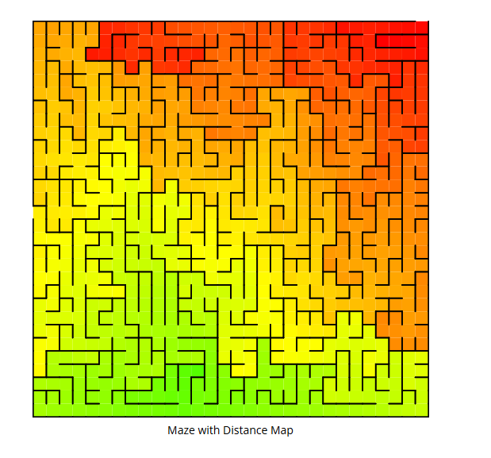

# Concepts
## [Maze Generation Algorithms](https://en.wikipedia.org/wiki/Maze_generation_algorithm)
### Depth-first search: 
> Mazes generated with a depth-first search have a low branching factor and contain many long corridors, because the algorithm explores as far as possible along each branch before backtracking.
- Recursive method: large depth of recursion, in the worst case, the routine may need to recur on every cell of the area being processed, which may exceed the maximum recursion stack depth in many environments
- Iterative method: Rearrange into a loop by storing backtracking information in the maze by implementing an explicit stack (allowing it to grow bigger with no harm)

### Randomized Prim's Algorithm:

### Randomized Kruskal's Algorithm:
- Because the effect of this algorithm is to produce a minimal spanning tree from a graph with equally weighted edges, it tends to produce regular patterns which are fairly easy to solve.

### Wilson's Algorithm:
-  Note that this random walk has a few constraints: although it can cross cells it has already walked (as long as they are not already in the maze), we don’t want to allow the final path to have any loops in it. Thus, we also record the direction most recently used to exit each cell, and will use those directions to form the final path once the walk encounters an “in” cell.
- Loop-erased random walks
- Uniform spanning tree
- random choice

#### Resources
- https://en.wikipedia.org/wiki/Loop-erased_random_walk
- https://weblog.jamisbuck.org/2011/1/20/maze-generation-wilson-s-algorithm
- https://www.astrolog.org/labyrnth/algrithm.htm#solve

### Aldous-Broder
### Fractal Tessellation algorithm 

## [Maze-Solving Algorithms](https://en.wikipedia.org/wiki/Maze-solving_algorithm)
- Maze-Solving algorithm: 
    - Wall-following: right-hand and left-hand 
    - Depth-first search and Breadth-first search
    - Pledge
    - Trémaux
    - Dijkstra
    - A-star

### Wall-following
Limitations
- Not Optimal: Does not guarantee the shortest path.
- Fails in Certain Mazes: Does not work for mazes with isolated walls or loops that are not connected to the boundary.

### Dead-end Filling
It can be used for solving mazes on paper or with a computer program, but it is not useful to a person inside an unknown maze since this method looks at the entire maze at once.

### Dijkstra's Algorithm

- Wiki: https://en.wikipedia.org/wiki/Dijkstra%27s_algorithm#:~:text=Dijkstra's%20algorithm%20(%2F%CB%88da%C9%AA,and%20published%20three%20years%20later.
- W3Schools: https://www.w3schools.com/dsa/dsa_algo_graphs_dijkstra.php
## Game & Simulation:
- State Machines
   + StepMode or time-step visualization

# To-dos
- [] Solver: Adding shadowy effect or contour on the walls to show a glowy neon effect
- [] Adding a GUI for menu panel : https://www.reddit.com/r/Python/comments/wedvzi/what_is_the_best_gui_library_for_python/
    - mazesize, block size
    - color setting for maze (pertinent to the maze design black-wall white-path or green-black)
    - find some ways to play with time speed to manipulate the progression to slow or fast (using `pygame.Clock`)
- [x] Pause and step function on the main display
- [x] After implementing the solver, adding a faded effect (using alpha stuff) to show like a trailing effect of the solver and show grids that the solver has been on
- [] After getting a functioning mazesolver, restructure the codebase into different maze classes for each type of maze generation? NOTE: NEED TO ==RESEARCH MORE ON THIS==
    + Abstract data types
    + dataclass
    + https://www.geeksforgeeks.org/abstract-data-types/
- [] Understanding PyTest, testing units and such:
    + unittest, pytest
    + https://docs.python-guide.org/writing/tests/

- [] Distance Map - Heatmap: finding the distance for a starting cell to other cells (kinda like Floyd-Warshall)

- [] Simultaneous Localization and Mapping for the real robotic mouse
- [] Create the design (black-wall, white-path) like the one in the Wikipedia
    - Color-picker
- [] HexaMaze, Triangular, Circular Grid
- [] Optimization 
- [] Integrate into a website?: https://www.browserstack.com/guide/web-development-in-python-guide
- [] printing into SVG or PNG format for generated maze

# Resources:
- Reference to one of the guys: https://github.com/keesiemeijer/maze-generator/tree/master
- _(a very cool application for referencing)_ Codebox Software: https://codebox.net/pages/maze-generator
- UML - LucidChart for state machine diagrams

# Problems & Debugs
## 3/14/2025
- we are using index for our Maze.mazeGrid like how tabular data works
    + By indexing [0][1], we should retrieve the 0th row and 1st column (with 0-indexing), however, as we compute the pygame coordinates: x = row * Size = 0 * Size, y = col * Size = 1 * Size. See that? Instead of shifting x by 0 rows (down) and shifting column by 1 (right), the grid is rather registered by shifting x by 1 row (down) and shifting column by 0 (right). XY in this 2D graphics and rows-columns are inverse
    + In a sense, the rows represent y-axis and the columns represent the x-axis, you see the transformation??
    + If you don't get it, accept it then it will make sense

## 3/17/2025
Pygame clock to manipulate with time: [`pygame.time`](https://www.pygame.org/docs/ref/time.html)
### pygame.time.Clock():
Creates a clock object to manage time in the game loop.
### `clock.tick(fps):`
> Limits the loop to run at the specified frames per second (FPS).
For example:
- fps = 10: The loop runs 10 times per second (slower).
- fps = 60: The loop runs 60 times per second (faster).
### Adjusting fps:
- You can dynamically adjust the fps value to change the speed of the loop during runtime.
- Example with Dynamic Speed Adjustment
    - You can add a key press event to increase or decrease the speed dynamically:

## 3/22/2025
Implementing pause function and step function on displaying

To implement **step iteration** in your program, you can use another key (e.g., **S** for "Step") to advance the maze generation by one step at a time. This allows the user to manually control the progress of the algorithm.

---

### Steps to Add Step Iteration
1. **Define a Step Mode**:
   - Use a boolean variable (e.g., `step_mode`) to track whether the program is in step iteration mode.

2. **Handle the Step Key**:
   - Use a specific key (e.g., **S**) to advance the maze generation by one step.

3. **Modify the Game Loop**:
   - When in step mode, wait for the user to press the step key to execute the next step of the algorithm.

### Explanation of Changes
1. **Step Mode**:
   - The `step_mode` variable tracks whether the program is in step iteration mode.
2. **Step Key**:
   - The **S** key (`K_s`) toggles step mode on or off.
   - When step mode is enabled, the **Right Arrow** key (`K_RIGHT`) performs one step of the algorithm.
3. **Game Loop Behavior**:
   - If `paused` is `True` and `step_mode` is `False`, the program skips the maze generation logic.
   - If `step_mode` is `True`, the program waits for the user to press the step key to execute the next step.
4. **Step Execution**:
   - The `maze.iterativeWilson()` method is called to execute one step of Wilson's algorithm when the **Right Arrow** key is pressed.

---

### Benefits
1. **Manual Control**:
   - The user can manually step through the maze generation process to observe each step in detail.
2. **Interactive Debugging**:
   - Step iteration is useful for debugging and understanding the algorithm's behavior.
3. **Seamless Integration**:
   - The step iteration feature is integrated into the existing game loop without disrupting normal execution.

This approach provides an interactive way to control the maze generation process step by step.

## 3/29/2025  
### Using a different class "Solver" apart from the "MazeMap" class
Implementing the solver separately from the MazeMap class -> This approach adheres to the principles of separation of concerns and modularity, making your code easier to maintain, extend, and test.
    
#### Why Use a Separate Class for the Solver? (or basically any other projects)
- Separation of Concerns:
   - The MazeMap class is responsible for generating and managing the maze.
   - The solver class should focus solely on solving the maze.
- Reusability:
   - A separate solver class can be reused with different maze implementations or configurations without modifying the MazeMap class.
- Extensibility:
   - You can easily add multiple solving algorithms (e.g., DFS, BFS, A*, Dijkstra) to the solver class without cluttering the MazeMap class.
- Testing:
   - A separate solver class makes it easier to test solving algorithms independently of the maze generation logic.

### Saving the Maze into a file
To create a maze, save it to a file, and then load it later for non-random testing with solving algorithms, you can serialize the maze's structure (e.g., walls and visited states) into a file. This allows you to reuse the same maze for consistent testing.

#### Steps to Implement
1. Serialize the Maze:
- Save the maze's structure (e.g., walls and visited states) to a file in a format like JSON or a custom format.
2. Deserialize the Maze:
- Load the maze's structure from the file and reconstruct the maze grid.
3. Use the Loaded Maze:
- Use the loaded maze for solving algorithms without regenerating it randomly.

## 4/1/2025
- Saving maze and loading maze for MazeMap objects
   - adding another element or condition of checking for loading if the dimension of the mazes are not match -> ELSE rescale the maze with a mathematical function (harder to implement)
   - TWO WAYS:
      + Validation
      + Rescaling
- Fixed the pause and stepMode phase:
   - If not in stepMode, then we can pause or resume whenever we like during the simulation
   - If we are in stepMode, then:
      1. We cannot use pause until we deactivate the stepMode
      2. During stepMode: pause will always be true
      3. Out of the stepMode: pause will be set to False to resume
      4. Advancing the time step by hitting the right arrow key -> `advancedOnestep` is now set to True
      5. pause is the overall encompassing function: so check for `paused` state
         1. if `stepMode` and `advanceOnestep` -> we set the advancedOnestep to false and run 1 time of our computation
         2. Else just skip the whole computation until we reset the `stepMode` as False or hit `advanceOnestep` again
- Added Solver's `randomMouse()` algorithm

## 4/16/2025
- If you want to initialize a matrix (2-D array) with infinity value (used in Dijkstra's algorithm):
```self.distances = [[float('inf') for _ in range(self.maze.cols)] for _ in range(self.maze.rows)] ```
, doing this: `self.distances = [[float('inf') * self.maze.cols] for _ in range(self.maze.rows)]` will only return a 1-D array

Feel free to try:
```py
distances = [[float('inf') * 5] for _ in range(6)]
distances_right = [[float('inf') for _ in range(5)] for _ in range(6)]    
print(distances)
print(distances_right)
maat = [[0]*5 for _ in range(6)]
print(maat)
```

